# Conduit — Architecture

> **The one-page version is [`architecture.png`](architecture.png)**, rendered from
> `scripts/architecture.html` by `npm run architecture`. This is the long form.
>
> Reference material lives in [`docs/`](docs/): the [API](docs/api.md),
> [data model](docs/data-model.md), [agent runtime](docs/agent-runtime.md),
> [security](docs/security.md), [UI](docs/ui.md), [deployment](docs/deployment.md),
> [development](docs/development.md) and [environment](docs/environment.md).

Conduit runs several coding CLIs in parallel, reads everything they print, and interrupts
you only when something needs a human. It is a supervision layer, not an orchestrator: the
human decides, and the machine's job is to make sure the right decision reaches them at the
right moment.

---

## 1. Core Paradigm

Three ideas hold the design together.

**Agents scale; attention does not.** One person can start ten agents and read none of
them. The bottleneck is not compute, it is the human's ability to notice. So Conduit reads
the output instead, and surfaces only what changes a decision.

**A gate is a decision, not a notification.** When something risky appears, the agent is
frozen where it stands. Not warned afterwards, not logged for later — stopped, with its
terminal in front of you, waiting. A notification you can scroll past is not a safety
mechanism.

**The supervisor proposes; the human disposes.** The Supervisor has exactly one write
tool, and it creates a *proposal*. Nothing it decides reaches an agent without a human
approving the exact text that would be sent.

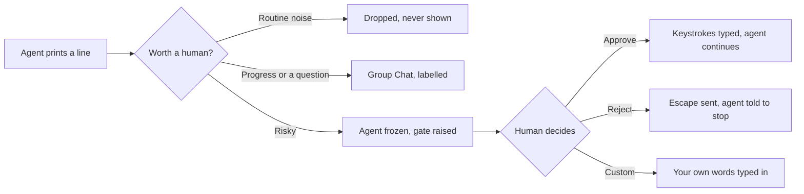

---

## 2. Architecture Topology

Two processes. The split exists for one reason: **terminal sessions must outlive the user
interface.** Refresh the browser, restart the web server, update the app — the agents keep
working.

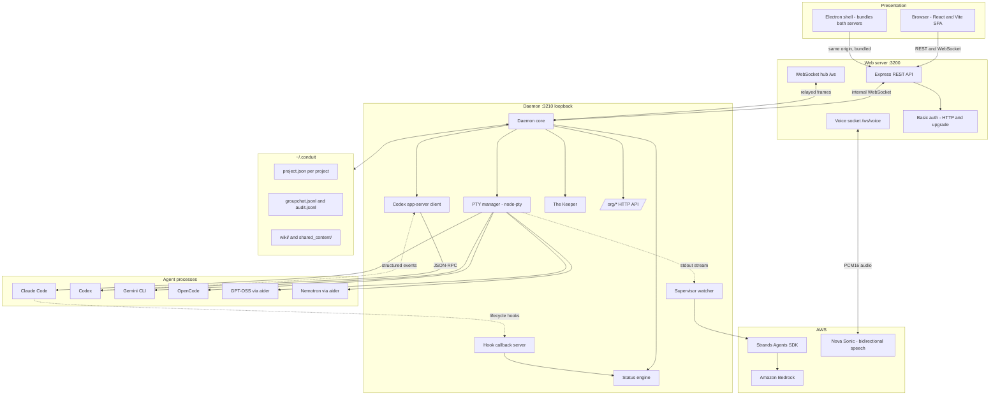

Solid arrows are synchronous calls. Dotted arrows are things the agents emit on their own
schedule.

**What the web server is not.** It owns no agent processes. Every operation that touches an
agent is relayed to the daemon over a local WebSocket (`src/daemon/protocol.ts`) which
reconnects on its own. This is the invariant the whole design rests on, and the one most
easily broken by adding a convenient `spawn` in a route handler.

---

## 3. Components Deep Dive

### 3.1 Web server — `src/server.ts`

Serves the React bundle, exposes REST (`src/routes.ts`), terminates the browser WebSocket,
and proxies voice audio. It holds **no durable state**: everything it knows, it asked the
daemon for.

`CONDUIT_AUTH=user:pass` puts Basic auth in front of HTTP *and* the WebSocket upgrade,
compared in constant time.

### 3.2 Daemon — `src/daemon/daemon.ts`

Owns every agent process and everything derived from watching them. Also hosts:

- the **hook callback server**, which Claude Code posts lifecycle events to
- the **`/org/*` HTTP API**, which the Keeper and the voice tools drive
- the **status engine**, which is the only writer of an agent's `status`

`src/daemon/runtime.ts` routes each operation to the right runtime, so the rest of the
daemon never knows whether it is talking to a terminal or a JSON-RPC thread.

### 3.3 Agent runtimes

Two, not six. `src/cli-registry.ts` is the single source of truth for which id maps to
which binary, install command and required environment.

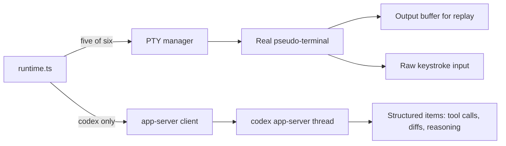

A PTY agent is genuinely interactive — you can click into it and type, and Conduit is just
another writer on the same terminal. Codex is not a terminal at all; its structured items
render as a transcript.

Output is buffered so that a browser attaching *after* an agent started gets a replay
rather than a blank pane. A browser that attaches before the agent runs is remembered
(`clientWanted`) and bound when it starts.

Full detail: [`docs/agent-runtime.md`](docs/agent-runtime.md).

### 3.4 The Supervisor — `src/strands/`

A Strands agent: `Agent` + `tool()` from `@strands-agents/sdk`, with `report_update` and
`plan_action` plus four read-only tools. What changes between providers is only the model
object handed to it.

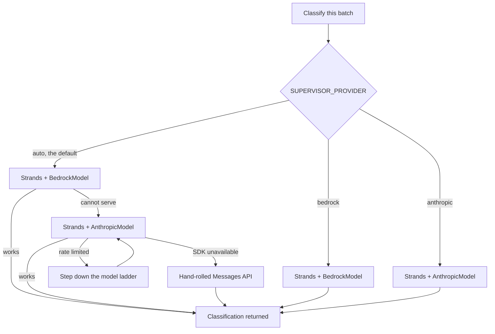

Both branches run through the SDK. That matters more than it sounds: a fallback that
bypassed the framework would mean the framework was absent exactly when the primary
provider was down, which is when you are most likely to be looking. A new AWS account is
capped near 10,000 Bedrock tokens a day until its quota is raised, so this is the common
case, not the edge case.

The ladder exists because a Claude Code subscription token is routinely refused on the
larger models and allowed on Haiku. A 429 on the top rung steps down rather than giving up.

`GET /api/health` reports `supervisorHealth.strands` — whether the last good classification
actually went through the SDK. *"The Supervisor works"* and *"the Supervisor works as a
Strands agent"* are different claims.

### 3.5 The Keeper — `src/daemon/orchestrator.ts`

An org-level agent, backed by `codex exec` or `claude -p`, with twelve MCP tools
(`src/conduit-mcp-server.ts`) covering every project rather than one. It answers "what is
running and what is blocked" without you opening a single terminal.

Its private state lives in `~/.conduit/brain-private`, deliberately outside any project
working directory — it used to live in its own cwd, where it would read its own history and
answer questions about projects you had deleted.

### 3.6 Voice — `src/voice/`

Amazon Nova Sonic over `InvokeModelWithBidirectionalStream`. The browser captures PCM16
through an AudioWorklet, gated by a VAD so the socket stays open but audio only flows above
the threshold. AWS credentials never leave Node.

Eight tools, of which two can do damage. See §6.2.

---

## 4. Execution Flows

### 4.1 Starting an agent

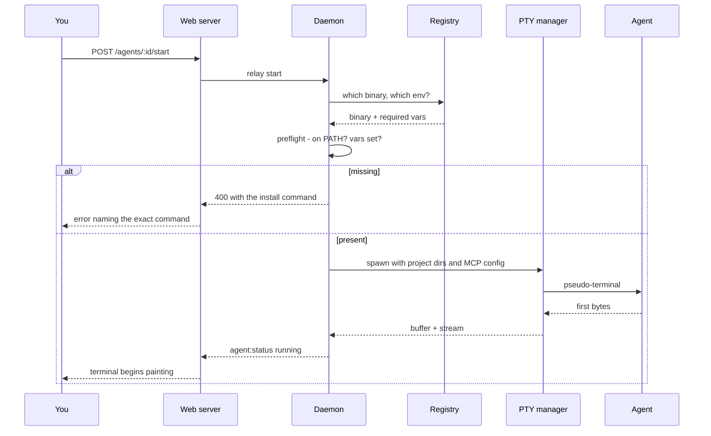

The preflight is why a missing CLI fails immediately with the command that installs it,
rather than opening a terminal that lands in a shell and looks alive.

### 4.2 The safety loop

Every line is read twice. The fast path never waits on a network round trip, because a
destructive command must not.

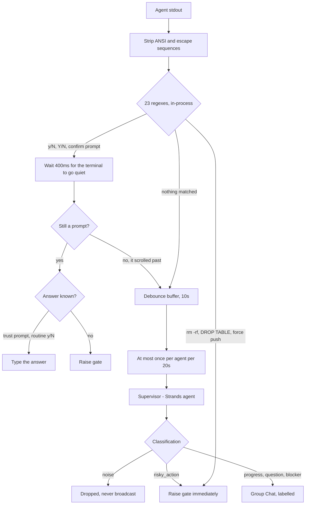

The 400ms settle window matters: a `[y/N]` that appears in scrolling output is not a prompt
waiting for you, it is text. Matching it eagerly typed characters into a terminal that was
not asking anything.

### 4.3 Resolving a gate

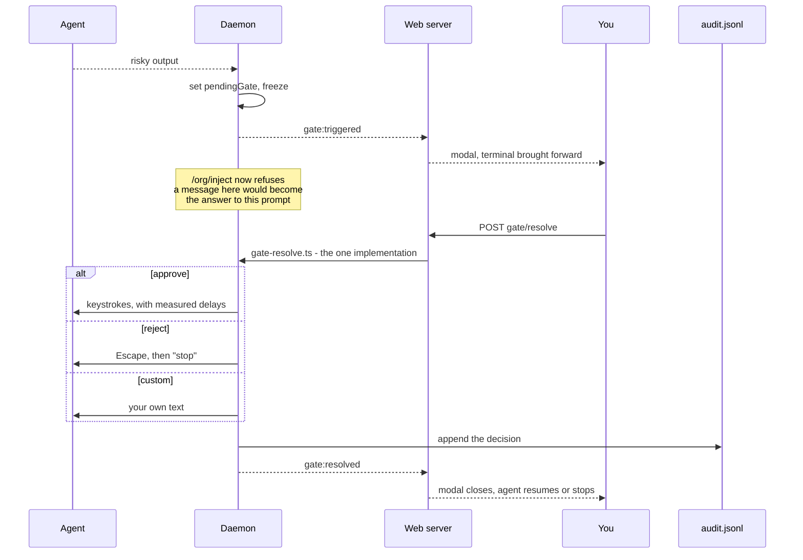

Resolution has exactly one implementation. Two copies would drift, and the half that
drifts is the one answering a destructive prompt.

### 4.4 A plan

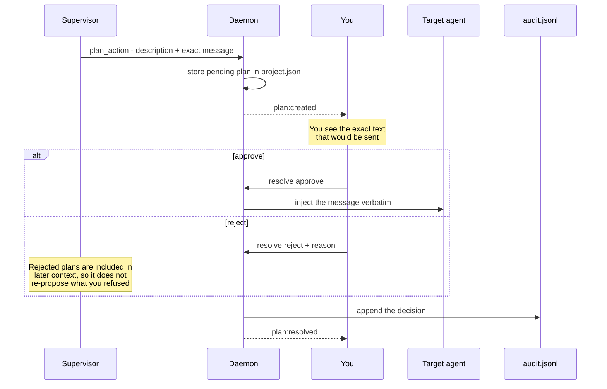

### 4.5 Approving by voice

The only place a mishearing could start something destructive, so the checks are on the
server, not in the prompt.

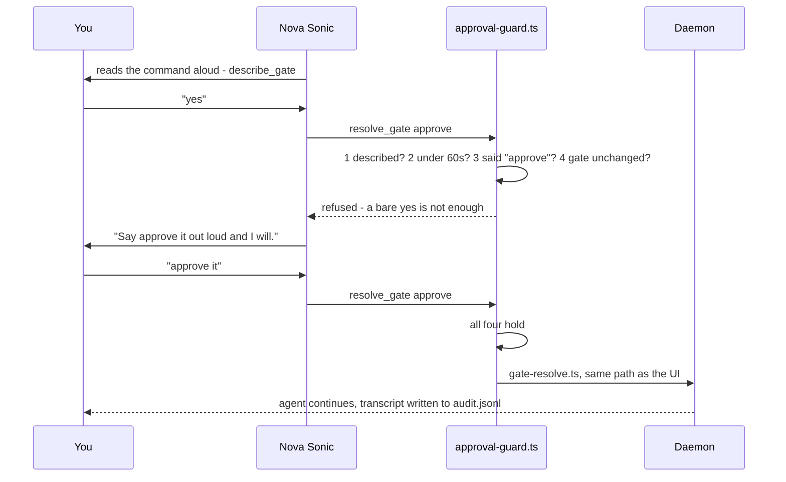

Rejecting needs none of this. Stopping something is always safe.

---

## 5. State & Persistence

No database. Plain JSON and JSONL, readable with `cat`, which is the point — when something
is wrong you can see it.

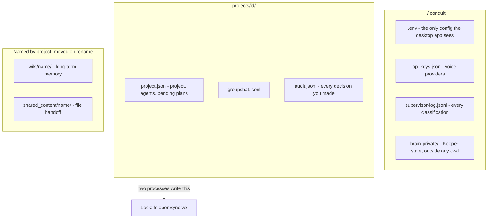

The agent status machine, derived live and never written by hand:

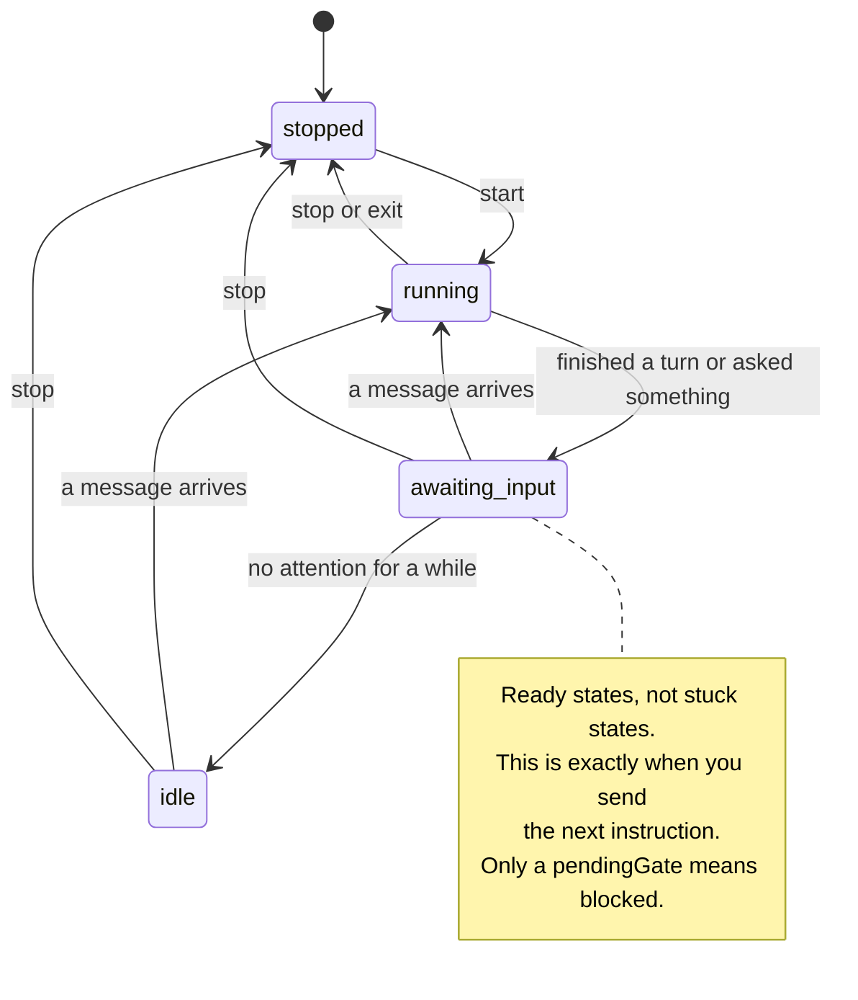

`project.json` is written by two processes. `mutateProjectData` takes a lock with
`fs.openSync(file, 'wx')` — atomic create, fails if it exists — around read-modify-write.
Measured at two processes × 150 writes: **0 lost out of 300**, file valid JSON at every
read, never observed empty.

The lock deliberately does **not** call `ensureDir`. It did once, and that recreated the
directory of a project you had just deleted.

Full schema: [`docs/data-model.md`](docs/data-model.md).

---

## 6. Security & Observability

### 6.1 What is protected

`CONDUIT_AUTH` covers HTTP and the WebSocket upgrade. Paths from user input never reach
`path.join` — `storage.resolveInside` resolves then asserts containment. Everything
rendered from model or agent text goes through DOMPurify. `GET /api/voice/config` returns
booleans, never keys.

### 6.2 The asymmetry in voice

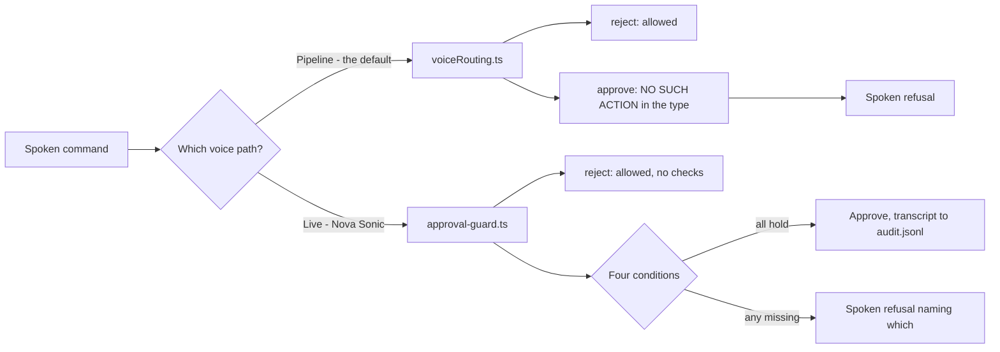

On the pipeline path approving is not disabled, it is **absent** — there is no approve
action in the router's union, so no transcript can produce one, and the unit tests assert
it. That path sees one sentence with no memory of what was read out; there is nothing it
could check.

### 6.3 What is deliberately not protected

The daemon's `/org/*` endpoints are **unauthenticated on loopback**. Any local process —
including an agent Conduit is running — can drive any agent through them, bypassing gates
and plan approval. A deliberate trade for a single-user local tool, and the wrong trade on
a shared machine.

Gates catch *patterns*. They are a seatbelt, not a sandbox.

Full treatment: [`docs/security.md`](docs/security.md).

### 6.4 Observability

| Signal | Where |
|---|---|
| `supervisorHealth` | `GET /api/health` — state, provider, model, `strands` |
| Daemon reachability | `GET /api/daemon/status` |
| Every classification | `~/.conduit/supervisor-log.jsonl` |
| Every decision you made | `audit.jsonl`, per project |
| Live UI events | `activity`, `org:changed`, `supervisor:update` on `/ws` |

---

## 7. Verification Matrix

Every claim above has a script behind it. No test framework — each prints what it checked
and exits non-zero.

| Subsystem | Command | Covers | Result |
| :--- | :--- | :--- | :--- |
| Gate patterns, policy, voice routing, approval guard, storage concurrency | `npm test` | 11 suites, no network | 292 passed |
| End to end | `npm run smoke` | REST, WebSocket, PTY dispatch, wiki, MCP routing | 61 passed |
| Every control | `npm run check:ui` | Buttons, routes, and every write read back through a different route | Clean |
| Layout | `npm run check:layout` | 11 surfaces × 4 widths: overflow, clipping, overlap, contrast, tap targets | No defects |
| Real browser | `npm run browser-check` | Interaction, asserts no uncaught exceptions | Clean |
| Org API | `npm run check:org` | Every `/org/*` endpoint the Keeper uses | Clean |
| Lifecycle | `npm run check:lifecycle` | Deleting a project mid-flight, restarting the daemon | Clean |
| Abuse | `npm run check:abuse` | Traversal, absurd input — no 5xx, no dropped connections | Clean |
| Agent types | `npm run check:agents` | One of every CLI | 6 / 6 |
| Concurrency | `npm run check:multi` | Four agents at once, gates, group chat, MCP | 26 / 26 |
| The Keeper | `npm run check:keeper` | Answers with working tools | Clean |
| Live voice | `npm run check:voice-live` | Wake, tool call, audio back | 659 ms |
| Packaged app | `npm run check:desktop` | Own daemon, all agent types, Bedrock parity, no orphans | 31 / 31 |
| Bedrock | `npm run check:bedrock` | Distinguishes IAM, entitlement and quota failures | Diagnostic |
| Types | `npm run typecheck` | Strict TypeScript, client and server | 0 errors |
