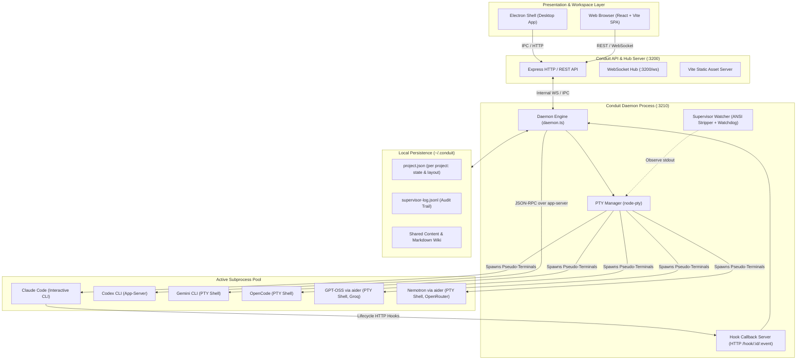
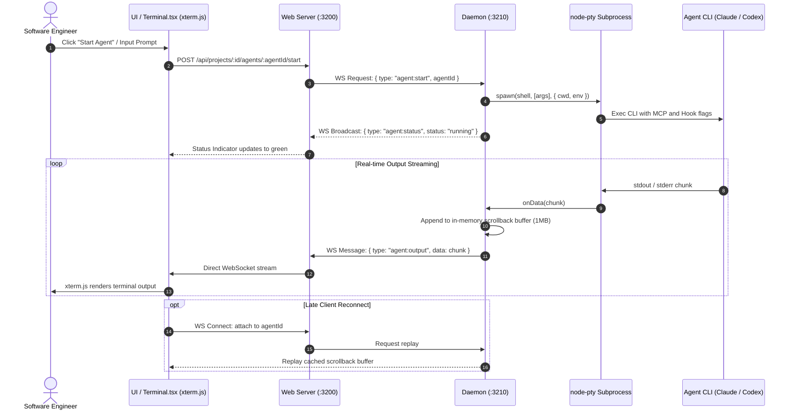
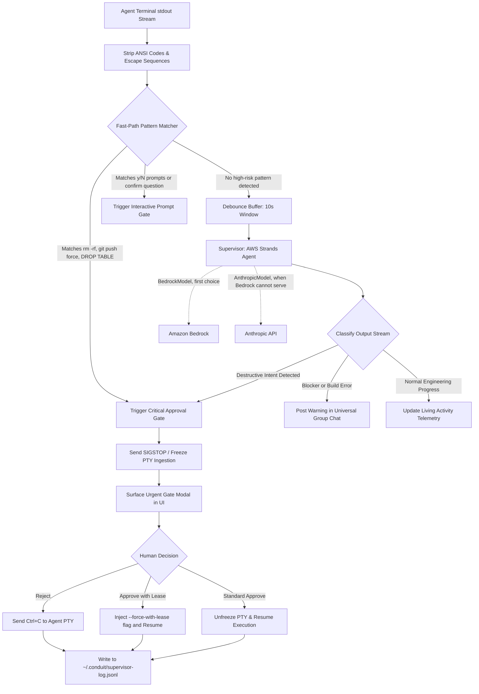
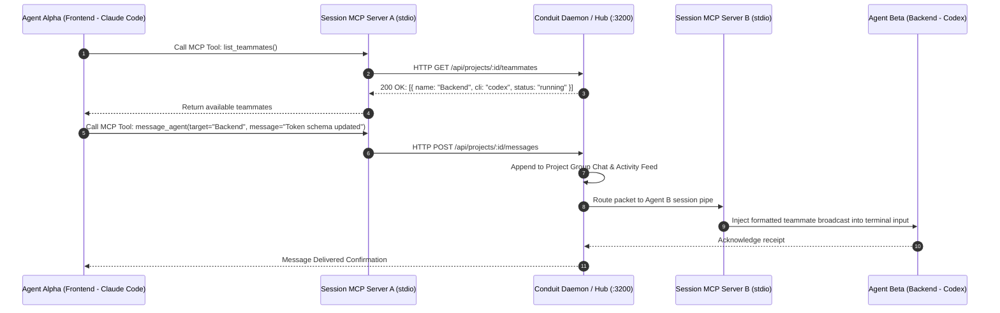
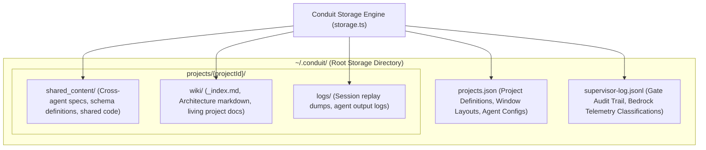

# Conduit System Architecture & Design Specification

This document provides a comprehensive, production-grade technical overview of the **Conduit** multi-agent control center architecture. It details the runtime lifecycle, inter-process communication (IPC), terminal virtualization, Amazon Bedrock supervision, Model Context Protocol (MCP) inter-agent messaging, and human-in-the-loop safety gates.

---

> **The one-page version is [`architecture.png`](architecture.png)**, rendered from
> `scripts/architecture.html` by `npm run architecture`. This file is the long form:
> the sequence diagrams, the storage layout and the verification matrix.

## 1. High-Level System Architecture

Conduit decouples the graphical user interface (Electron/Browser) from the long-running process manager (Conduit Daemon). This guarantees that terminal sessions, agent compilations, and git workflows never terminate if the frontend is refreshed, closed, or updated.



### Architectural Highlights:
1. **Daemon Survivability**: The daemon runs on `127.0.0.1:3210`. If the web server or Electron UI restarts, all agent sub-shells continue running without dropping state.
2. **Dual-Channel Protocol**: The frontend connects to the server via WebSocket for sub-10ms xterm.js streaming and state broadcasts, and uses REST for project CRUD and configuration.
3. **Zero External Dependencies**: All state is persisted locally in `~/.conduit` (JSON and JSONL), ensuring offline capability and zero third-party database overhead.

---

## 2. Process Lifecycle & Terminal Virtualization (PTY Engine)

Conduit virtualizes terminals using native C++ bindings (`node-pty`) connected via streaming WebSocket multiplexers to browser xterm.js instances.



### Key Technical Details:
- **Scrollback Replay Buffer**: The daemon retains an in-memory ring buffer of the last 1MB of terminal output per agent. Late reconnects or tab switches instantly replay the terminal state without waiting for a new process event.
- **PTY Environment Sanitization**: Each PTY shell is injected with custom `CONDUIT_PROJECT_ID`, `CONDUIT_AGENT_ID`, and session-scoped MCP configurations.

---

## 3. Human-in-the-Loop Safety Loop & Approval Gate

Conduit protects codebases from destructive autonomous actions through a dual-layer watchdog architecture combining **zero-latency regex pattern matching** with **Amazon Bedrock AI classification**.



### Safety Engine Guarantees:
1. **Zero Execution Before Veto**: When a destructive pattern is detected, the daemon halts keystroke input to the PTY before the command executes.
2. **Audit Accountability**: All decisions, whether human-approved or human-rejected, are written immutably to `supervisor-log.jsonl` with timestamps and commit SHAs.

---

## 3a. The Supervisor, and which provider serves it

The Supervisor is a Strands agent: `Agent` + `tool()` from `@strands-agents/sdk`, with
`report_update` and `plan_action` as its tools plus four read-only ones. What changes
between providers is only the model object handed to it.

| `SUPERVISOR_PROVIDER` | Behaviour |
|---|---|
| `bedrock` | `BedrockModel` only |
| `anthropic` | `AnthropicModel` only |
| `auto` (default) | Bedrock first; Anthropic when Bedrock cannot serve the request |

Both run through the SDK, so losing a provider costs a provider rather than the
framework. That matters on a new AWS account, where Bedrock is capped near 10,000
tokens a day until the quota is raised — before this, the fallback called the Messages
API by hand and the SDK dropped out of the running system exactly when Bedrock was
unavailable.

`GET /api/health` reports `supervisorHealth`:

```json
{ "state": "ok", "provider": "bedrock", "model": "us.anthropic...", "strands": true }
```

`strands` is whether the last good classification actually went through the SDK.
"The Supervisor works" and "the Supervisor works as a Strands agent" are different
claims, and only one of them is the one this project makes.

Beneath both sits a hand-rolled Messages API call, used only if the optional
`@anthropic-ai/sdk` peer is missing at runtime or the SDK path fails outright.

## 4. MCP Inter-Agent Autonomous Communication

Agents running concurrently within a project communicate and discover each other peer-to-peer using the **Model Context Protocol (MCP)** specification.



### MCP Infrastructure Details:
- **Session Isolation**: Each agent gets a dedicated JSON-RPC stdio server configured automatically in its working directory (`.claude.json` / `codex.json`).
- **No Shared Network Ports**: Agents communicate exclusively through Conduit's local IPC hub, eliminating rogue socket exposure.

---

## 5. Storage & State Persistence Architecture

Conduit operates as a local-first system with a deterministic filesystem layout under `~/.conduit/`.



### State Storage Specifications:
| Entity | Location | Serialization | Concurrency Strategy |
| :--- | :--- | :--- | :--- |
| **Projects & Agents** | `~/.conduit/projects.json` | JSON | Atomic write via tempfile rename |
| **Audit Logs** | `~/.conduit/supervisor-log.jsonl` | Append-only JSONL | Synchronous stream append |
| **Project Wiki** | `~/.conduit/projects/:id/wiki/` | Markdown (`.md`) | File-system watch via `chokidar` |
| **Shared Content** | `~/.conduit/projects/:id/shared/` | Plain text / Code | Path-traversal sanitized filesystem API |

---

## 6. End-to-End Verification Matrix

| Subsystem | Test Command | Coverage Area | Status |
| :--- | :--- | :--- | :--- |
| **Safety Gates** | `npm test` | Regex fast path, ANSI stripping, destructive command traps | 19 / 19 Passed |
| **Core End-to-End** | `npm run smoke` | WebSocket hub, PTY dispatch, Project Wiki, MCP routing | 51 / 51 Passed |
| **Static Types** | `npm run typecheck` | Strict TypeScript across client, server, and daemon | 0 Errors |
| **Client Bundler** | `npm run build:client` | Production Vite minification & rollup chunking | 0 Errors |
| **Desktop Packaging** | `npm run build:desktop` | Electron packaging, Windows NSIS installer | Ready |
