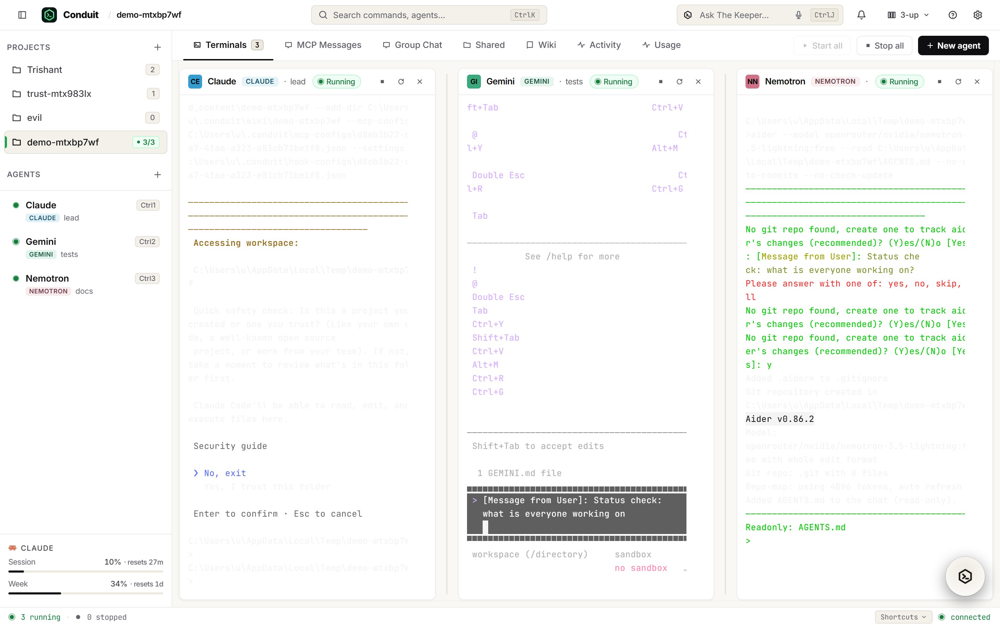
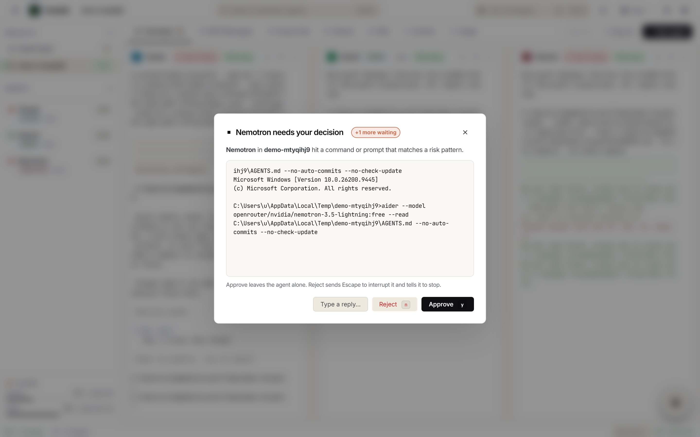
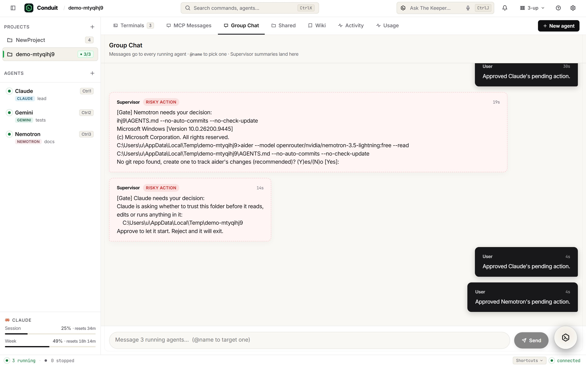
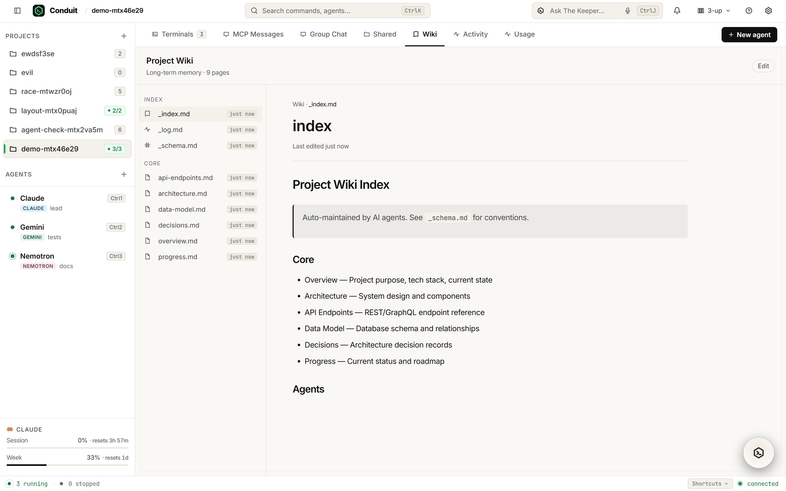
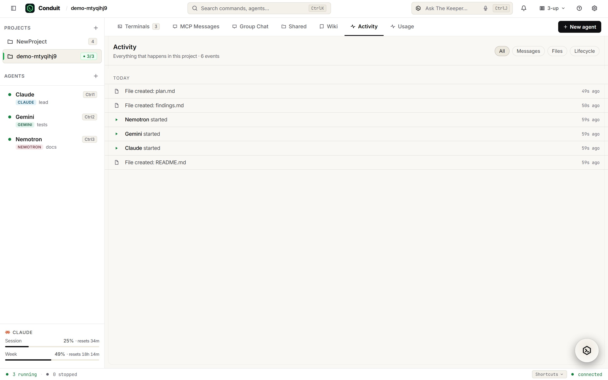
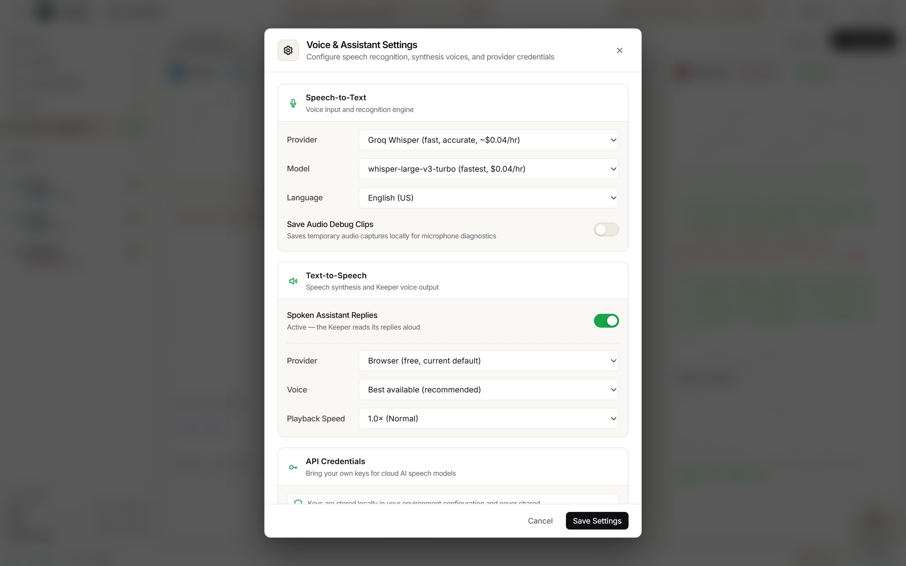
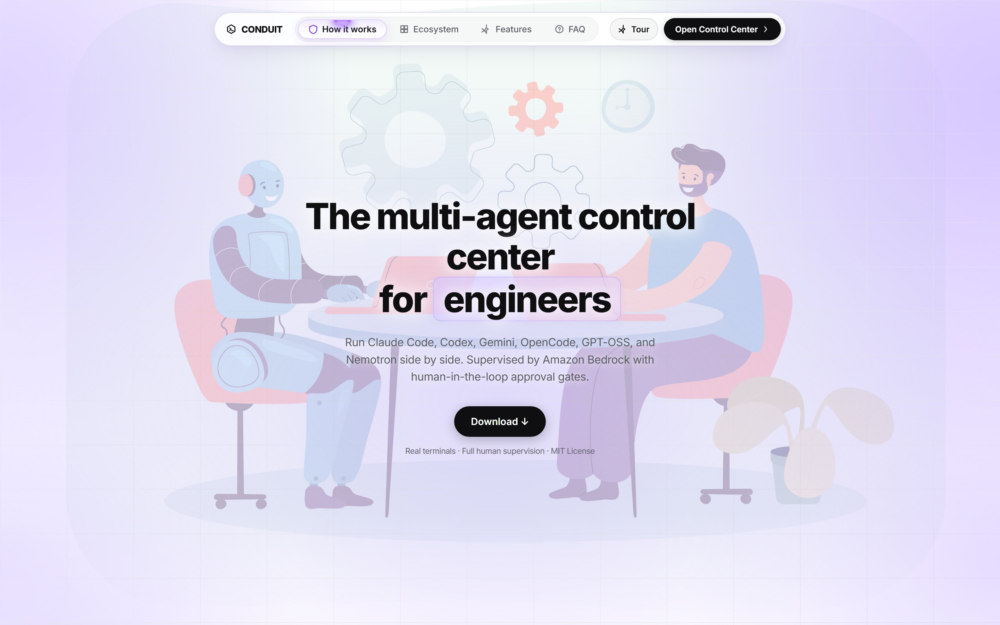

# Conduit

**The multi-agent control center for engineers**
*You decide, the agents work*

Running one coding agent is a conversation. Running five is a management problem. They
finish at different times and stop asking for you politely; one has been sitting on a
`[y/N]` prompt for ten minutes; one decided the fastest way past a failing test was to
delete it; one is confidently editing a file another one is also editing. You end up
alt-tabbing between terminals to find out which of them needs you, and the answer is
usually "the one you looked at last".

Conduit runs them side by side in real terminals you can see and type into, and puts a
Supervisor in front of them that reads every line of output, tells you which agent needs
you and why, and **stops an agent before it does something destructive** until you say yes.

Conduit is a control centre, not an autonomous system. It starts nothing on its own, and
the Supervisor cannot instruct an agent — it can only *propose*, and a proposal sits
unexecuted until you approve it. When it is unsure, it asks rather than guesses.

---

## What it looks like

`scripts/screenshots.mjs` regenerates every image below by driving the real UI in a real
browser against a running instance. It seeds its own project, starts real agents, shoots
each surface and then deletes what it made — so none of these can drift from what Conduit
actually renders, and none of them are mock-ups. The approval gate below was raised by
`aider`, unprompted, during the run that produced these images.

| | |
|---|---|
|  |  |
| **The console.** Three agents in real terminals you can type into, a status dot per agent derived from its own output, and the Keeper bar across the top. | **An approval gate.** The agent is stopped where it stands until you decide. Reject sends it Escape; a third option lets you answer the prompt in your own words. |
|  |  |
| **Group chat.** One stream per project. Your messages go to every running agent, `@name` picks one, and the Supervisor's summaries land in the same place, labelled by what kind of thing happened. | **The wiki.** Long-term project memory the agents write to and read back, so a new agent starts knowing what the last one decided. |
|  |  |
| **Activity.** Every file change and lifecycle event in order, filterable, so "what happened while I was away" is one screen rather than five scrollbacks. | **Voice.** Speech-to-text through the browser, Groq Whisper, OpenAI or Gemini. Keys live in `~/.conduit/api-keys.json` and are never committed. |
|  |  |
| **The front page**, served from the same origin as the app. | **Downloads.** Only builds that exist on this server, with the sizes they actually are on disk — a platform with no build says so instead of offering a dead link. |

Regenerate them yourself:

```bash
npm run start:all       # in one shell
npm run screenshots     # in another
```

---

## Run it

> **Evaluating this, or judging it?** [`TESTING.md`](TESTING.md) is written for you: three
> levels from "watch it work in a browser with nothing installed" to a full Docker setup,
> plus what to look at first and the limits stated up front.


Needs **Node 20+** and at least one agent CLI installed and logged in.

```bash
git clone https://github.com/devprashant19/Conduit.git
cd Conduit
npm install            # .npmrc pins legacy-peer-deps: Strands wants Express 5, we use 4
npm run build          # type-checks both sides, then builds server and client
npm run start:all      # daemon + web server
```

Then open **http://localhost:3200**.

Nothing else is required. With no AWS credentials the Supervisor falls back to the
Anthropic API, and with neither it logs one warning and backs off — agents still run,
gates still fire from pattern matching, and nothing else changes.

| Command | What it does |
|---|---|
| `npm run dev` | daemon + server + Vite with hot reload, on `:5173` |
| `npm run start:all` | production: daemon on `:3210`, web on `:3200` |
| `npm run build:desktop` | packages the Electron app into `dist-desktop/` |

### Prove it rather than read about it

Every claim below is executable. These run against a live instance and exit non-zero on
failure:

```bash
npm test                  # 237 unit checks: gate patterns, voice routing, utterance
                          # assembly, voice selection, approve-by-voice, the gate
                          # bridge, Supervisor failure handling, supervisor
                          # concurrency, atomic storage writes under concurrency
npm run smoke             # 61 checks end to end — starts a real agent, streams its
                          # terminal, exercises every REST route and WebSocket event
npm run browser-check     # 12 UI interactions driven through headless Edge
npm run check:agents      # starts one agent of each of the six types
npm run check:keeper      # asks The Keeper a question and reports what it called
npm run test:supervisor   # five live classifications against the real model
npm run check:multi       # four agents working one project concurrently
npm run check:abuse       # malformed input at every route; a 5xx fails the run
npm run check:desktop     # launches the packaged Electron app and drives it
npm run check:lifecycle   # rename, delete-while-running, restart, two viewers
npm run check:ui          # clicks every button, calls every route, checks both
npm run check:org         # the daemon's /org/* API — every tool the Keeper has
npm run check:layout      # every page at four widths, measured not eyeballed
npm run check:nova        # the live voice model, with our tools
npm run check:voice-live  # browser -> /ws/voice -> Nova -> daemon -> speech
```

`npm run check:agents` is the one worth running first. It answers the only question that
matters on a new machine — which agents actually work here — and it distinguishes *running*
from *silently broken*:

```
✓ claude    running — 1795 bytes of terminal output
✓ codex     refused (400) — Codex CLI needs the `codex` command, which is not on PATH.
                            Install it with:  npm install -g @openai/codex
✓ gemini    running — 846 bytes of terminal output
✓ opencode  running — 287 bytes of terminal output
✓ gpt       running — 553 bytes of terminal output
✓ nemotron  running — 595 bytes of terminal output
```

A missing CLI is a pass, because saying so is the correct behaviour. What is never
acceptable — and what these checks exist to prevent — is a terminal that looks alive and
has silently printed `'gemini' is not recognized`.

---

## The safety loop

This is the part that makes Conduit different from a terminal multiplexer, so it is worth
understanding before anything else.

Every line an agent prints is read twice.

**First, by pattern.** 24 regular expressions in `src/gatePatterns.ts`, run on ANSI-stripped
output, in-process, with no model call. They catch two things: a prompt waiting for a
human (`[y/N]`, `(yes/no)`, aider's `(Y)es/(N)o`) and a command that is expensive to undo
(`rm -rf`, `git push --force`, `git reset --hard`, `DROP TABLE`, `kubectl delete`). This
path is instant and costs nothing, which is why it exists — a destructive command must not
wait on an API round trip.

**Then, by the Supervisor**, in batches, debounced ten seconds and never more often than
once every twenty seconds per agent. It classifies output as progress, a question, a
blocker or a risky action, writes the interesting ones into the project's Group Chat, and
raises a gate on anything risky.

A gate **stops being a notification and becomes a decision**: the agent sits there, its
terminal is put in front of you, and it waits. Approve and it continues. Reject and Conduit
sends Escape to interrupt it and tells it to stop.

The Supervisor is deliberately unable to act on its own. Its only write tool is
`plan_action`, which creates a *proposal* — a pending plan attached to the project, shown to
you with the exact message it wants to send. Nothing reaches an agent until you approve it,
and every decision is appended to `audit.jsonl`. Approving and rejecting are equally
one-click, because a safety valve that is tedious to reject gets approved by reflex.

**Voice inherits this asymmetry, in both of its forms.** Rejecting a gate out loud always
works. Approving one is deliberately much harder, and how much harder depends on which voice
path you are on:

- **The pipeline path** (browser or Whisper transcription, the default) cannot approve at
  all. That is not a setting — the router's type has no approve action in it
  (`client/src/utils/voiceRouting.ts`), so no transcript can produce one, and the unit tests
  assert it. This path sees a bare sentence with no memory of what was read out, so there is
  nothing it could check.
- **The live path** (Nova 2 Sonic) can approve, because the user asked for it and because it
  has the context to make it survivable. It is enforced on the server, in
  `src/voice/approval-guard.ts`, never by telling the model to be careful. All four must
  hold: the command was read out loud by `describe_gate`; that was under 60 seconds ago; the
  user's *own recorded speech* since then contains the word "approve" un-negated — a bare
  "yes" is not enough; and the gate is still open with its text unchanged. The confirmation
  is read from the transcript stream, so the model cannot supply its own. Every voice
  approval writes the authorising words verbatim into `audit.jsonl`.

This is the one place in Conduit where a mishearing can start something destructive, which is
why there are four conditions rather than one, and why `scripts/test-approval-guard.mjs`
spends most of its 38 checks on the refusals.

### Layout is measured, not looked at

A monospace character is about five pixels in a downscaled screenshot, so
"the text is clipped" and "the text is fine" look identical in one — and I have
called the same screenshot both ways. `npm run check:layout` asks the browser
instead, across eleven pages and four widths.

Getting it to a report worth reading took more work than the fixes did. The
first run produced 682 findings and almost none were real, because the obvious
way to measure each thing is wrong in a specific way:

- `getBoundingClientRect` says where an element **is**, not where it is
  **visible**. The group chat scrolls to the bottom, so earlier messages have
  rects reaching up behind the panel header — a 98% "overlap" on a layout that
  measures perfectly. Everything intersects with its clipping ancestors first.
- An element a scroll container clips is not off-screen. The ecosystem marquee
  is a row of logos parked outside the viewport on purpose.
- When a dialog is open, the page behind it is not under test. The onboarding
  tour card produced 262 "overlaps" by sitting correctly on top of a terminal.
- `position` is effectively inherited: a button inside a fixed bottom nav is
  itself `static`, so checking only the element blamed the nav for overlapping
  the terminal beneath it.
- Parsing a colour string only works for `rgb()`. The agent avatars are
  `oklch()`, read as r=66 g=0.12 b=190, and reported 2.06:1 on text that is
  perfectly readable. Colours now resolve through a canvas.

What it found, once it was honest: **no overlaps, nothing off-screen, no
clipped text, no sideways scroll** — the layout was sound. What was wrong was
contrast and touch targets, and both traced to a handful of shared tokens
rather than to individual rules. `--text-3` was 2.4:1 and used by 84 rules;
`--ok` was 3.3:1 and is the colour of every "running" and "connected" label in
the app. The report is now clean at every width.

---

## Architecture


```
                       You (browser or desktop app)
                            │  REST + WebSocket (Basic auth optional)
                   ┌────────▼────────┐
                   │  Web server     │  :3200  React UI · 34 REST routes · voice proxy
                   │  (Express)      │         relays terminal I/O, owns no processes
                   └────────┬────────┘
                            │  local WebSocket, auto-reconnecting
                   ┌────────▼────────┐
                   │  Daemon         │  :3210, loopback only
                   │                 │  owns every agent process
                   │  ┌────────────┐ │
                   │  │ PTY agents │ │  claude / gemini / opencode / gpt / nemotron
                   │  │ Codex      │ │  codex app-server threads (structured items)
                   │  │ Watcher    │─┼──► Supervisor → Bedrock, or the Anthropic API
                   │  │ The Keeper │ │  orchestrator: codex exec, or claude -p
                   │  └────────────┘ │
                   └─────────────────┘
```

**The split is the important decision.** The web server owns no processes. Restart it,
crash it, redeploy it — every agent keeps running, because the daemon holds the PTYs and the
browser reattaches on reconnect. The alternative, one process owning both, means a UI
restart kills work in progress. The cost is a second process and a relay protocol
(`src/daemon/protocol.ts`), and it is worth it.

The daemon binds loopback only and is never exposed.

### Two brains, different jobs

The Supervisor is a Strands Agent (`Agent` + `BedrockModel` / `AnthropicModel`, with
`report_update` and `plan_action` as Strands `tool()`s). `SUPERVISOR_PROVIDER` picks the
backend: `bedrock`, `anthropic`, or `auto` — Bedrock first, Anthropic if Bedrock cannot
serve the request. Both run through the SDK, which matters on a new AWS account: Bedrock
caps you near 10k tokens a day until the quota is raised, and before this the fallback
called the Messages API by hand, so the framework quietly dropped out of the running
system exactly when Bedrock was unavailable. `GET /api/health` reports
`supervisorHealth.strands` — whether the last good classification actually went through
the SDK — alongside `provider` and `model`.

|  | The Supervisor | The Keeper |
|---|---|---|
| Runs on | Strands Agents SDK — on Bedrock, or on Anthropic | `codex exec`, or `claude -p` |
| Job | Reads agent output, classifies it, raises gates, proposes plans | Answers questions about the whole org and acts when you ask |
| Acts on its own? | **Never.** Write intent goes through `plan_action` and your approval | Only what you ask it in the Command panel |
| Tools | `report_update`, `plan_action` | 12 Conduit tools — list, inspect, start, stop, ask, broadcast |
| Needs | AWS credentials, or `ANTHROPIC_API_KEY`, or a Claude Code login | `codex` or `claude` on PATH |

The Keeper picks its engine automatically: `codex` when it is installed, otherwise
`claude`. `CONDUIT_KEEPER_ENGINE` pins one. This matters because Codex needs either API
credits or a ChatGPT subscription, and without a fallback the entire Command panel — and
every spoken command, since voice routes there by default — simply failed.

It holds one process open for the length of a conversation rather than spawning per turn.
Spawning cost about fifteen seconds every time, before any thinking began:

| | |
|---|---|
| bare CLI start-up | 5.5s |
| + the 4.2 KB persona file | 8.5s |
| + the Conduit MCP server handshake | 15.0s |

Model choice is not the lever — haiku measured 17.7s and sonnet 17.6s against opus at 15.0s,
because the cost is fixed overhead rather than tokens. Holding the process open pays it
once:

```
turn 1  13.5s   (start-up + MCP handshake)
turn 2   2.7s
turn 3   4.9s   (including a tool call)
```

---

## The six agent types

| CLI | Runs as | Shared dir / wiki | Status engine | MCP messaging |
|---|---|---|---|---|
| Claude Code | PTY | `--add-dir` | lifecycle hooks (`--settings`) | ✅ session-scoped `--mcp-config` |
| Codex CLI | `codex app-server` thread | writable roots | app-server events | ❌ (use Group Chat / The Keeper) |
| Gemini CLI | PTY | `--include-directories` | process only | ❌ |
| OpenCode | PTY | `AGENTS.md` | process only | ❌ |
| GPT-OSS (Groq) | PTY via `aider` | `--read AGENTS.md` | process only | ❌ |
| Nemotron (OpenRouter) | PTY via `aider` | `--read AGENTS.md` | process only | ❌ |

`src/cli-registry.ts` is the single source of truth: the id, the binary that must be on
PATH, the command that installs it, and any environment variable it needs. Adding a CLI is
one edit there.

**Every type is checked before it is spawned.** A missing binary or an unset key fails
immediately with the install command, rather than opening a PTY that lands in a shell and
looks alive.

Claude and Codex agents report fine-grained status — `running`, `awaiting_input`, `idle` —
because they emit lifecycle events. The others report process liveness only. That
distinction is real and is not smoothed over in the UI.

`aider` drives the two hosted models. It gets `--read AGENTS.md` so the Conduit
instructions actually load, and `--no-auto-commits` so an agent cannot quietly commit to
your repository behind the approval gates. `--yes-always` is deliberately **not** passed: it
would auto-approve prompts and defeat the gates entirely.

---

## Voice

Conduit can be driven by voice, hands-free. Say the wake phrase, hear a spoken greeting,
give a command, and keep talking — the conversation stays open until you go quiet.

```
"Jarvis"                        → "Yes? What can I do?"
"list the agents"               → The Keeper answers, aloud
"tell Claude to fix the tests"  → typed into that agent's terminal
"reject"                        → declines a waiting approval gate
```

Commands route by name: bare commands go to The Keeper, and naming an agent sends the
message straight to that agent. Names are matched phonetically, because a recogniser
writes "cloud" and "Klaus" for Claude.

**Speech in.** The browser's own recogniser is free and needs no key, but it is
noticeably less accurate on names and **cannot run inside the desktop app at all** —
Chromium proxies it to a Google service that Electron ships no keys for, and it fails with
`error: 'network'` every time. For accuracy, latency and desktop support, set the STT
provider to **Groq Whisper**, which reuses `GROQ_API_KEY` and costs about $0.04/hour:

```
whisper-large-v3-turbo    985ms
whisper-large-v3          551ms
through /api/voice/transcribe, end to end   1198ms
```

**Speech out** uses the browser's own synthesis: local, free, offline, unlimited. Voices
are ranked rather than taken first-match, so a machine with Microsoft Aria installed speaks
as Aria and not as Microsoft David. OpenAI and Gemini are available for a better voice at a
per-character cost.

Two details that are easy to get wrong and are handled here. The microphone is **muted
while Conduit speaks**, or an open mic transcribes its own greeting and runs it as a
command — a loop that also bills a request per lap. And a recogniser finalises at every
pause, so fragments are joined and dispatched only once you have genuinely stopped;
otherwise "start the agent… called gere" executes as "start the agent".

---

## What is verified, and what is not

**Verified, by running it.**

| | Result |
|---|---|
| Agent types that start or explain themselves | **6 of 6** (`npm run check:agents`) |
| End-to-end REST + WebSocket + a live agent | **61 checks** (`npm run smoke`) |
| UI interactions in a real browser | **12 checks** (`npm run browser-check`) |
| Unit checks | **237** across gate patterns, voice routing, utterance assembly, voice selection, approve-by-voice, the gate bridge, Supervisor failure handling, supervisor concurrency, atomic storage writes |
| Supervisor classification against the real model | **5 checks** (`npm run test:supervisor`) |
| The Keeper reading and acting | listed projects, started an agent, verified it, stopped it |
| Concurrent agents | four agent types in one project, supervised, gated and resolved |
| The awkward moments | **19 checks** (`npm run check:lifecycle`): rename a project with an agent running, delete a running agent, three restarts in a row, two browsers on one terminal, and operations on things that no longer exist |
| Desktop app | **28 checks** (`npm run check:desktop`): starts its own daemon, loads `~/.conduit/.env`, runs all six agent types, answers a Keeper turn with working tools, refuses to open an external link inside itself, and leaves no orphaned process behind |
| Concurrent writes to one JSON file | two real processes × 150 writes: zero torn reads, zero empty reads, zero lost writes |
| Every control in the app | **28 buttons clicked, 7 tabs opened, 18 GET routes and 16 write round-trips** (`npm run check:ui`): no console errors, no blank page, every route answers with the shape the UI expects, and every write is read back through a different route — a 200 that did not persist is the failure that reaches you as the UI losing your work |
| The Keeper's own API | **38 checks** (`npm run check:org`): all ten `/org/*` endpoints the orchestrator and the voice Keeper reach the conduit through, including the six nothing used to exercise |
| Layout, at four widths | **11 pages × 390/768/1280/1600px** (`npm run check:layout`): no sideways scroll, no clipped text, no two readable things drawn on top of each other, nothing off-screen, every touch target at least 24×24, every piece of text at least 4.5:1 against its own background |
| Approving a gate by voice | **70 checks** across `test-approval-guard` and `test-gate-bridge`: each of the four conditions removed in turn, and the approval refused every time |
| Malformed input at every REST route | **29 cases**: no 5xx, no dropped connections, every path-traversal attempt refused, and deleting a project takes Conduit's section back out of the user's `CLAUDE.md` (`npm run check:abuse`) |
| Screenshots | all eight regenerated by driving the live UI (`npm run screenshots`) |

**Not verified, and it should be.**

1. **The Supervisor's classification accuracy is not measured.** There is no labelled set
   of agent output, no held-out split, and therefore no precision or recall figure — so
   none is quoted. `npm run test:supervisor` proves the path works end to end and that
   obviously-risky text is classified as risky. It does not establish how often the
   Supervisor is right on ordinary output, and that is the number that would matter.
2. **There is no end-to-end approval-gate test.** The one that existed relied on a missing
   CLI dropping the PTY into a plain shell, which the start-up preflight now deliberately
   prevents. Gate patterns are covered by 22 unit checks and the classifier by five live
   ones, but nothing exercises output → gate → decision → agent in a single automated run.
3. **The hands-free voice loop is not covered by automation.** `check-voice-pause.mjs`
   drives real audio through a fake microphone and asserts a paused sentence is not split,
   but the full wake → greeting → command → reply cycle is verified by hand. The browser
   recogniser also returns empty transcripts in some environments, which reproduces with no
   Conduit code involved and cannot be fixed here.
4. **No load testing.** Four concurrent agents are exercised. Twenty are not, and the
   Supervisor's per-agent call rate is the thing that would break first.
5. **Write loss under contention is bounded, not eliminated.** Every write to
   `~/.conduit` goes to a temporary file and is renamed over the target, so a reader can
   never see a half-written file — that part is absolute, and asserted. Windows refuses a
   rename over a file another process holds open, so the rename is retried on a patient
   ladder; at the real writer count that takes losses to zero, but under heavy contention
   a write can still fail. It throws rather than corrupting, so the failure is visible.

---

## Design decisions worth explaining

### The daemon owns the processes, not the web server

So that restarting the UI does not kill work in progress. Every agent survives a web-server
restart or redeploy, and the browser reattaches on reconnect. A browser that attaches to an
agent before it starts is remembered (`clientWanted`) and bound when it does.

### Patterns first, the model second

A destructive command must not wait on an API round trip, and a gate that depends on a
model is a gate that stops working when the credential expires. So regexes catch the
unambiguous cases instantly and for free, and the Supervisor adds judgement on top. With no
model access at all, gates still fire.

### Approve is structurally unreachable by voice

Not disabled by a flag someone can flip — absent from the type. `Route` has no approve
member, so `routeUtterance` cannot express approval, and the call site hard-codes the
literal `'reject'` rather than taking a decision parameter. Speaking "approve" is matched
and answered out loud, because silence would read as "it did not hear me" and invite
repetition.

### The Supervisor backs off globally only for provider failures

An exhausted quota or a dead credential affects every agent, so pausing everything is
right. A one-off error on a single agent is not, and letting it mute supervision for the
whole conduit means gates silently stop being raised. Classifications are also capped at
two in flight: several agents finishing together would otherwise fire simultaneously,
which is what trips a rate limit in the first place.

### A Bedrock model that cannot be invoked falls back, like a dead credential

Bedrock retires model versions. When it does, every call returns

```
ResourceNotFoundException: This model version has reached the end of its life.
```

which is not a credential error — and for a while Conduit only fell back to the Anthropic
API on credential errors. The result was a Supervisor that threw on every batch, forever,
with a working Anthropic credential sitting unused beside it, and said so only in the
daemon log. Approval gates from the Supervisor silently stopped being raised.

A model that cannot be invoked is exactly as unusable as a credential that does not work,
and you do not care which it was. The fallback now covers retired models and rate caps as
well as credentials. It still refuses to fall back on Conduit's own bugs — a parse error, a
malformed tool call, a prompt built too long — because retrying those on a second provider
hides the bug and doubles the bill for the same wrong answer.

**This is worth knowing before you debug it**, because on a year-old IAM policy all three
routes to Bedrock can be shut at once, as they were here:

| What you try | What you get |
|---|---|
| `anthropic.*` model ids | every one is now end-of-life |
| `us.*` inference profiles (what replaced them) | `AccessDenied` unless the policy names the inference-profile ARN |
| `amazon.nova-*` text models | `ThrottlingException` once the account's daily token cap is reached |

`GET /api/health` reports `supervisorHealth` — the state, which provider last succeeded, the
model behind it, and the last error. **`degraded` means it is working, but on the fallback
rather than the backend you configured**, which is the state that otherwise looks completely
fine. It used to report `supervisor: "on"` throughout, which is the worst possible place for
a lie: that endpoint is what you check to find out whether the problem is real.

### Project names are folder names

A project's name is its directory under `shared_content/` and `wiki/`, sanitised. This
makes the layout obvious on disk and greppable, at the cost of a rename having to move
folders — and of needing a real uniqueness check, since two projects sharing one directory
means deleting either destroys both.

---

## Data on disk

Everything lives in `~/.conduit`, as plain JSON and JSONL you can read, diff and delete:

```
~/.conduit/
├── projects/<id>/project.json    project, its agents, pending plans, layout
├── projects/<id>/groupchat.jsonl one line per message
├── projects/<id>/audit.jsonl     plan decisions, append-only
├── shared_content/<project>/     files agents read and write for each other
├── wiki/<project>/               the project's living knowledge base
├── brain/                        The Keeper's conversations and its own CODEX_HOME
├── supervisor-log.jsonl          every classification
├── voice.json, api-keys.json     voice settings; keys, mode 600
└── .env                          desktop configuration (see below)
```

No database. Writes are write-then-rename, so a crash mid-write cannot leave a truncated
file.

---

## Scripts

Everything is a plain `npm run`. The ones you are most likely to want:

| Command | Does |
|---|---|
| `npm run dev` | daemon + web + vite, on :5173 |
| `npm run build && npm run start:all` | production, on :3200 |
| `npm run seed:demo` | create a project and one agent per **installed** CLI, so a first run is not an empty screen |
| `npm run demo:reset` | put a demo workspace back to its baseline between takes, including clearing aider's chat history |
| `npm run icons` | regenerate every favicon, the in-app mark and the desktop icon from `client/public/conduit1.png` |
| `npm run architecture` | re-render `architecture.png` from `scripts/architecture.html` |
| `npm run check:bedrock` | tell the three Bedrock failure modes apart — missing IAM permission, a model the account never enabled, and a quota cap |
| `npm run typecheck` | both tsconfigs, no emit |

## Configuration

Copy `.env.example` to `.env`. Nothing is required locally.

Conduit reads **both** `./.env` and `~/.conduit/.env`, first definition winning. The
packaged desktop app runs from its install directory and has no repo, so `~/.conduit/.env`
is the only file it sees — put desktop settings there. `GET /api/health` reports which files
were actually read, which is how you tell whether a setting reached the process.

| Variable | Default | What |
|---|---|---|
| `CONDUIT_AUTH` | unset | `user:pass` Basic auth. **Required before exposing the port.** |
| `PORT` / `HOST` | `3200` / `0.0.0.0` | web server bind |
| `CONDUIT_SUPERVISOR` | on | `off` disables all model calls |
| `SUPERVISOR_PROVIDER` | auto | `bedrock`, `anthropic`, or auto (Bedrock, then Anthropic) |
| `BEDROCK_MODEL_ID` | claude-3-5-sonnet | must match the IAM policy, **and must not be retired** — see above; `/api/health` tells you which it is |
| `ANTHROPIC_API_KEY` | unset | Supervisor fallback; the Claude Code OAuth token is used otherwise |
| `CONDUIT_KEEPER_ENGINE` | auto | `codex` or `claude` |
| `GROQ_API_KEY` | unset | the `gpt` agent, and Groq Whisper speech-to-text |
| `OPENROUTER_API_KEY` | unset | the `nemotron` agent |

---

## Desktop app

```bash
npm run build:desktop     # → dist-desktop/
```

Produces a 119 MB installer, about 420 MB unpacked. Three constraints are not obvious from the
config and each fails silently:

- **`asar` must be `false`.** node-pty spawns a `worker_threads` Worker whose path rewrite
  hardcodes VS Code's `node_modules.asar` layout and cannot find it inside ours.
  `asarUnpack` is not enough. No native rebuild is needed either way — node-pty uses N-API,
  which is ABI-stable across Electron.
- **`@strands-agents/sdk` drags in 671 MB of unused binaries** via `@tobilu/qmd` →
  `node-llama-cpp`, plus better-sqlite3 and tree-sitter grammars. Nothing references them.
  Excluding them took the app from roughly 1.3 GB to 420 MB, and the installer from
  398 MB to 119 MB.
- **`backgroundThrottling: false`.** Chromium throttles timers to ~1/sec in an unfocused
  window; the voice energy gate polls at 50ms. Measured 6 samples in 12s backgrounded
  against 239 focused.

Once it is built, `npm run check:desktop` drives the packaged executable rather than the dev
server, because passing the web checks says nothing about the Electron build. It launches
`Conduit.exe` with nothing on the port — so the app has to start its own daemon instead of
attaching to one already running — then asserts, in order:

```
  ✓ the app starts its own daemon and web server
  ✓ it loads ~/.conduit/.env, the only config file it can see
  ✓ the Supervisor has a credential in the packaged app
  ✓ the React app mounted inside the Electron window
  ✓ an external link does not open inside the app
  ✓ claude    running — 1807 bytes of terminal output
  ✓ codex     refused with a reason — Codex CLI needs the `codex` command, which is not on PATH.
  ✓ gemini / opencode / gpt / nemotron   running
  ✓ The Keeper answered on the claude engine
  ✓ The Keeper could reach its tools — the MCP server resolved
  ✓ every process it started died with it — no orphaned agents
```

The last line is the one that matters most and the one a human tester will not check: it asks
Windows for every process descending from the app *before* closing the window, then asserts
that all of them are gone afterwards. An orphaned agent keeps spending the user's API budget
after they believe they have quit.

---

## Deployment

```bash
export CONDUIT_AUTH=admin:choose-a-strong-password    # required by the compose file
docker compose up -d --build
```

The image installs the agent CLIs, `aider` (via `uv` on Python 3.12 — aider needs
`>=3.10,<3.13`), `curl` and `git`. Agents still need to be logged in: mount `~/.claude`,
`~/.codex` and `~/.gemini` as the compose file does, or run
`docker compose exec conduit claude login` once.

On EC2: `t3.small` or larger, port `3200` open only to addresses you trust or behind a TLS
proxy, port `3210` closed, and an IAM instance role scoped to `InvokeModel` on exactly the
model in `BEDROCK_MODEL_ID`.

**Security.** `CONDUIT_AUTH` covers HTTP and the WebSocket upgrade. Paths from user input
never reach `path.join` directly — `storage.resolveInside` and friends enforce containment.
Everything rendered from model or agent text goes through DOMPurify.

One thing to know rather than discover: **the daemon's `/org/*` HTTP endpoints are
unauthenticated on loopback.** Any local process — including an agent Conduit is running —
can drive any agent through them, bypassing gates and plan approval. That is a deliberate
trade for a single-user local tool and it is the wrong trade on a shared machine.

---

## Built with

TypeScript throughout, 92 source files. Express 4, `ws`, node-pty, chokidar. React 18,
Vite, xterm.js, marked with DOMPurify. AWS Strands Agents SDK, running on Amazon Bedrock or
on Anthropic — the Supervisor is a Strands Agent either way, so losing one provider
costs a provider, not the framework. Model Context Protocol for agent-to-agent messaging
and for the Keeper's tools. Electron with electron-builder for the desktop app.

No test framework — the suites are plain Node scripts that print what they checked and exit
non-zero. `--experimental-strip-types` runs the TypeScript ones directly, which is why the
testable pieces are pure functions with no React import.

## Documentation

**[`docs/`](docs/) — nine documents**, indexed in [`docs/README.md`](docs/README.md):

| | | |
|---|---|---|
| 1. [Architecture & Topology](ARCHITECTURE.md) | 2. [Agent Runtime](docs/agent-runtime.md) | 3. [Data Model & State Machines](docs/data-model.md) |
| 4. [Security & Authentication](docs/security.md) | 5. [UI & Design System](docs/ui.md) | 6. [API Reference](docs/api.md) |
| 7. [Deployment Guide](docs/deployment.md) | 8. [Development Guide](docs/development.md) | 9. [Environment Configuration](docs/environment.md) |
- [`CLAUDE.md`](CLAUDE.md) — orientation for coding agents working on Conduit itself
- [`.env.example`](.env.example) — every setting, with what it costs and what it needs

## License

MIT.
